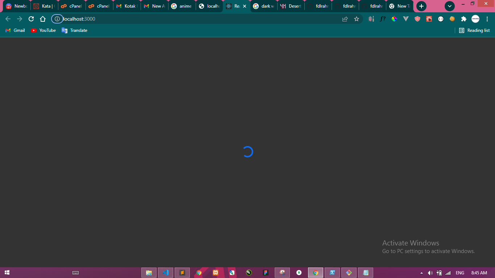
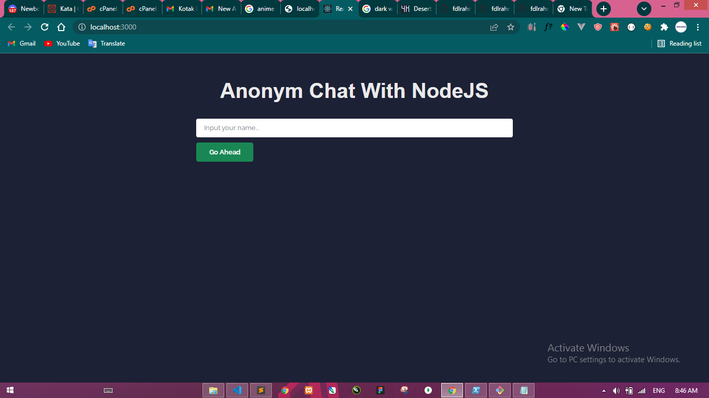
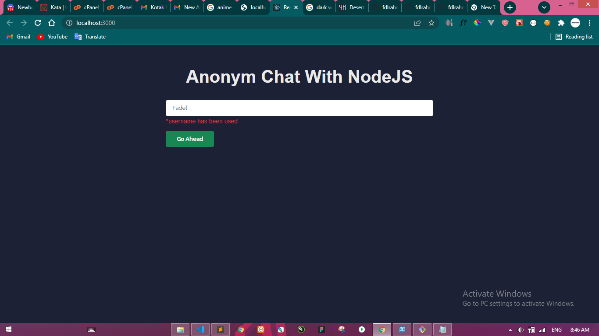
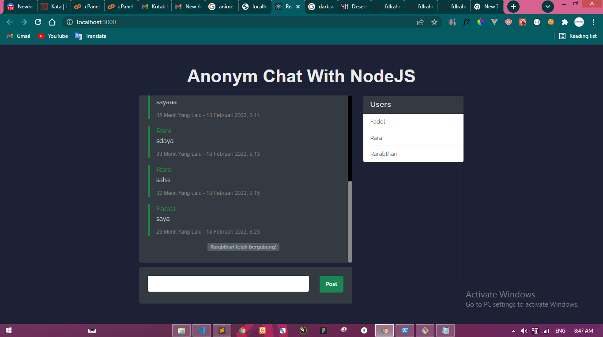
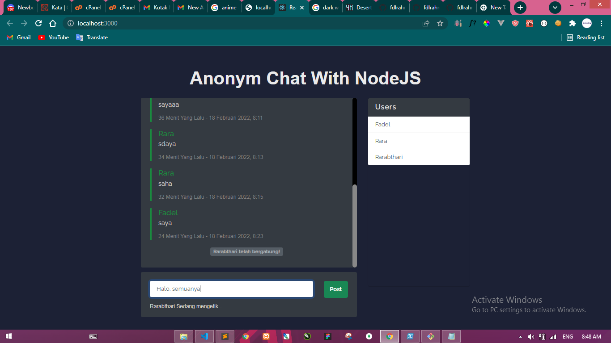

<h1 align="center">Mern Aplikasi Chat Online</h1>
<p align="center">
  Aplikasi dapat kalian kembangkan, ada beberapa hal yang bisa dikembang kan. Seperti, chat hanya tersimmpan di file json saja. Belum tersimpan ke database. Ada juga fitur
  yang belum terselesaikan seperti nontifikasi, dll. Bisa kalian gunakan sebagai bahan percobaan maupun latihan, Lakukan apa saja sesuai kemauan kalian.
  Hal yang penting juga terbuat dari <strong>React</strong> sebagai front end dan <strong>Nodejs</strong> sebagai API. <br />
  <i>*Fun Fact: dibuat 2 Jam 34 Menit 53 Detik.</i>
</p>

## Fitur
### Lazy Loading


<p>Sebelum terbuka, maka akan ada loading terlebih dahulu. Ya biasalah,</p>

### Masukin Nama Sebelum Mengechat



<p>
  Sebelum berinteraksi bersama teman teman di KasiColi (Aplikasi chat online), Biar lebih mudah sebut nya. Kalian harus masukin dulu nama ente nih.
  Kalo misalnya udah kepaka oleh teman lain gak bisa, maka akan ada pesan: Username has been used, makanya belajar bahasa arab GBLK. عفوا (Maaf).
  Ya gitu temen temen ya, Jadi kalo udah ada yang menggunakan Rarabthari kamu harus mencari Nama baru.
</p>

### Chat Realtime


<p>
  Jika telah masuk, maka akan muncul "Rarabthari telah bergabung". itu akan diliat secara realtime di tiap browser teman KasiColi kita.
  Disitulah kita sudah bisa berinteraksi secara realtime.
</p>

### Chat Typing


<p>
  Jikalau sedang mengetik maka, akan muncul di setiap browser teman KasiColi kita juga. Bilang si rarabthari sedang mengetik. Gitulah kira kira.
  Bused kalo lebih dari satu orang gimana, Santai GBLK. Maka akan di join(', '). Nanti lu bikin sendiri aja dah sendiri kalo yang 1 lainnya sedang mengetik GBLK. عفوا (Maaf)
  Nah gini temen" kalo lebih dari satu orang "Rarabthari, Fadel sedang mengetik". Ciee ketik barengan, Eisss ad ada aja antum.
</p>

## Setup Projek
<p>Silahkan dibuka terlebih dahulu terminalnya<p>
<h5>install & Jalankan server nya dengan mengetik kode dibawah ini</h5>
 
Nodejs
```
cd api || Masuk Ke Folder Api
npm install || Install Package Node Modules
npm start || Menjalankan Server Node JS
```

Reactjs
```
cd app || Masuk Ke Folder App
npm i react-scripts || Menginstall React Scripts (Optional sih kadang harus diinstal dulu.)
npm start || Menjalankan Server React JS
```

<p>Lah Kalo 3000 sama sama gabisa dong? Tenang GBLK nodejs port nya 3001. Jangan banyak ngomong dah coba aja dulu GBLK<p>

## Catatan
<p><i>Ditulis oleh Bobon Santosa (CEO OF GBLK)</i></p>
<p>
  "seorang master samurai lebih banyak melakukan kesalahan, daripada samurai pemula."
  I am fadhlurrahman, the one and only, <strong>Stay Classy!</strong>
</p>
